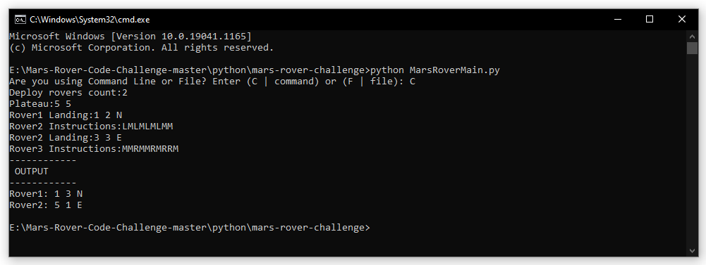
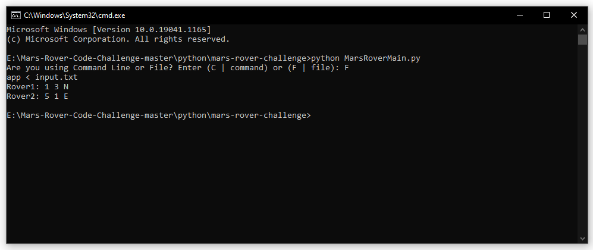

## How To Check

step 1: Git clone or download zip folder
```
git clone https://github.com/katheermizal/mars-rover-challenge.git
```
step 2: Navigate to `mars-rover-challenge` folder
```
cd mars-rover-challenge
```
step 3: Open commandline and navigate into target folder
step 4: Run the folowing command
```
python MarsRoverMain.py
```
step 5: then you have to choose, are you going use `command input` or `file input`. 
Terminal will look like this
```
Are you using Command Line or File? Enter (C | command) or (F | file):
```
If you decided to go with command-line input, Enter (C | command) 
```
Are you using Command Line or File? Enter (C | command) or (F | file): C
```
or
```
Are you using Command Line or File? Enter (C | command) or (F | file): command
```
If you decided to go with file input, Enter (F | file)
```
Are you using Command Line or File? Enter (C | command) or (F | file): F
```
or
```
Are you using Command Line or File? Enter (C | command) or (F | file): file
```
step 6: In commands input you have to provide the following details
```
Deploy rovers count: 2
Plateau:5 5
Rover1 Landing:1 2 N
Rover1 Instructions:LMLMLMLMM
Rover2 Landing:3 3 E
Rover2 Instructions:MMRMMRMRRM
```
step 7: Ouput for input commands



step 8: Ouput for input file




## Mars Rover Task

A squad of robotic rovers are to be landed by NASA on a plateau on Mars.

This plateau, which is curiously rectangular, must be navigated by the rovers so that their on board cameras can get a complete view of the surrounding terrain to send back to Earth.

A rover's position is represented by a combination of an x and y co-ordinates and a letter representing one of the four cardinal compass points. The plateau is divided up into a grid to simplify navigation. An example position might be 0, 0, N, which means the rover is in the bottom left corner and facing North.

In order to control a rover, NASA sends a simple string of letters. The possible letters are 'L', 'R' and 'M'. 'L' and 'R' makes the rover spin 90 degrees left or right respectively, without moving from its current spot.

'M' means move forward one grid point, and maintain the same heading.

Assume that the square directly North from (x, y) is (x, y+1).

Input:

Configuration Input: The first line of input is the upper-right coordinates of the plateau, the lower-left coordinates are assumed to be 0,0.

Per Rover Input:

Input 1: Landing co-ordinates for the named Rover. The position is made up of two integers and a letter separated by spaces, corresponding to the x and y co-ordinates and the rover's orientation.

Input 2: Navigation instructions for the named rover. i.e a string containing ('L', 'R', 'M').

Test Input:
```
Plateau:5 5
Rover1 Landing:1 2 N
Rover1 Instructions:LMLMLMLMM
Rover2 Landing:3 3 E
Rover2 Instructions:MMRMMRMRRM
```

Expected Output:
```
Rover1:1 3 N
Rover2:5 1 E
```
Task:

Develop a command line app that can take the various inputs from the command line and generate the desired outputs. The application must accept a sequence of inputs from the command line or a file. Example input from file:
```
$ app < input.txt
Rover1:1 3 N
Rover2:5 1 E
$
```
See `input.txt` in this repo for a sample test input.

Expectations:

- App should be working
- Code should be modular and readable
- Unit tests
- Your choice of language is one with which you are comfortable
